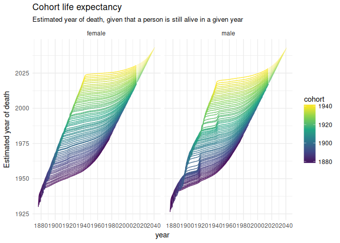
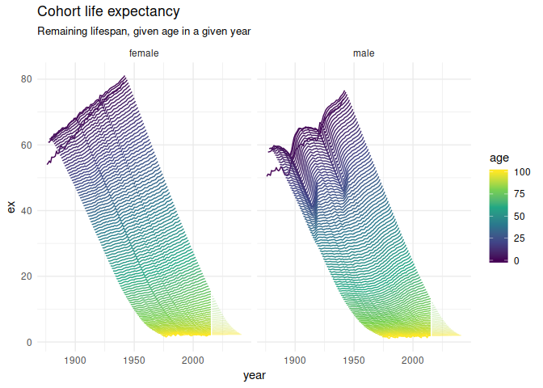
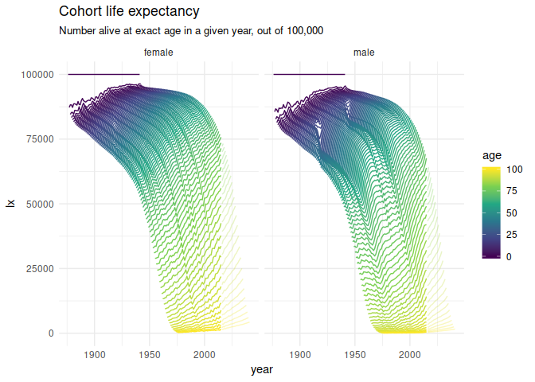
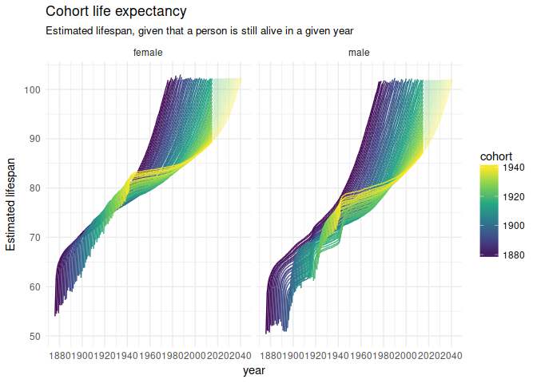
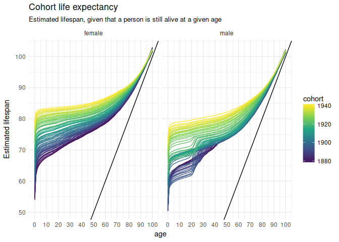
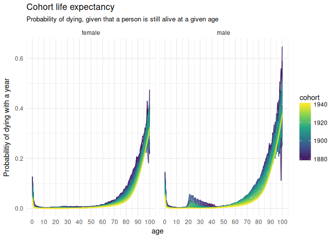
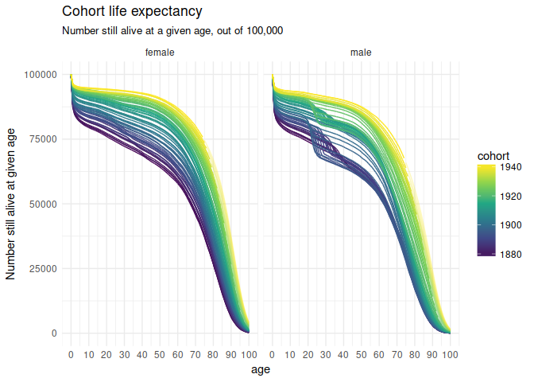

<!-- README.md is generated from README.Rmd. Please edit that file -->
nzlifetables
============

The `nzlifetables` package distributes the Statistics New Zealand Cohort Life Tables [spreadsheet](http://www.stats.govt.nz/browse_for_stats/health/life_expectancy/cohort-life-tables-info-releases.aspx) in convenient, `tidy` form.



Variables
---------

-   `sex`
-   `cohort`
-   `age` Exact age (years)
-   `lx` Number alive at exact age, out of 100,000 born
-   `Lx` Average number alive in the age interval, out of 100,000 born
-   `dx` Number dying in the age interval, out of 100,000 born
-   `px` Probability that a person who reaches this age lives another year
-   `qx` Probability that a person who reaches this age dies within a year
-   `mx` Central death rate for the age interval
-   `sx` Proportion of age group surviving another year
-   `ex` Expected number of years of life remaining at age x
-   `projected` Whether or not the statistic is a projection

Installation
------------

``` r
# install.packages("devtools")
devtools::install_github("nacnudus/nzlifetables")
```

Examples
--------

``` r
library(tidyverse)
library(nzlifetables)
theme_set(theme_minimal())
```

``` r
nzlifetables %>%
  mutate(year = cohort + age) %>%
  ggplot(aes(year, ex, colour = age,
             group = interaction(age, projected),
             alpha = -projected)) +
  geom_line() +
  scale_colour_viridis_c() +
  scale_alpha(range = c(.3, 1), guide = FALSE) +
  facet_wrap(~ sex) +
  ggtitle("Cohort life expectancy",
          sub = "Remaining lifespan, given age in a given year")
```



``` r
nzlifetables %>%
  mutate(year = cohort + age) %>%
  ggplot(aes(year, lx, colour = age,
             group = interaction(age, projected),
             alpha = -projected)) +
  geom_line() +
  scale_colour_viridis_c() +
  scale_alpha(range = c(.3, 1), guide = FALSE) +
  facet_wrap(~ sex) +
  ggtitle("Cohort life expectancy",
          sub = "Number alive at exact age in a given year, out of 100,000")
```



``` r
nzlifetables %>%
  mutate(year = cohort + age,
         year_of_death = year + ex) %>%
  ggplot(aes(year, year_of_death, colour = cohort,
             group = interaction(cohort, projected),
             alpha = -projected)) +
  geom_line() +
  scale_x_continuous(breaks = full_seq(c(1880, 2040), 20)) +
  scale_colour_viridis_c() +
  scale_alpha(range = c(.3, 1), guide = FALSE) +
  facet_wrap(~ sex, nrow = 1) +
  ylab("Estimated year of death") +
  ggtitle("Cohort life expectancy",
          sub = "Estimated year of death, given that a person is still alive in a given year")
```


``` r
nzlifetables %>%
  mutate(year = cohort + age,
         lifespan = age + ex) %>%
  ggplot(aes(year, lifespan, colour = cohort,
             group = interaction(cohort, projected),
             alpha = -projected)) +
  geom_line() +
  scale_x_continuous(breaks = full_seq(c(1880, 2040), 20)) +
  scale_colour_viridis_c() +
  scale_alpha(range = c(.3, 1), guide = FALSE) +
  facet_wrap(~ sex, nrow = 1) +
  ylab("Estimated lifespan") +
  ggtitle("Cohort life expectancy",
          sub = "Estimated lifespan, given that a person is still alive in a given year")
```



``` r
nzlifetables %>%
  mutate(lifespan = age + ex) %>%
  ggplot(aes(age, lifespan, colour = cohort,
             group = interaction(cohort, projected),
             alpha = -projected)) +
  geom_line() +
  geom_abline(intercept = 0, slope = 1) +
  scale_x_continuous(breaks = full_seq(c(0, 100), 10)) +
  scale_colour_viridis_c() +
  scale_alpha(range = c(.3, 1), guide = FALSE) +
  facet_wrap(~ sex, nrow = 1) +
  ylab("Estimated lifespan") +
  ggtitle("Cohort life expectancy",
          sub = "Estimated lifespan, given that a person is still alive at a given age")
```



``` r
nzlifetables %>%
  ggplot(aes(age, qx, colour = cohort,
             group = interaction(cohort, projected),
             alpha = -projected)) +
  geom_line() +
  scale_x_continuous(breaks = full_seq(c(0, 100), 10)) +
  scale_colour_viridis_c() +
  scale_alpha(range = c(.3, 1), guide = FALSE) +
  facet_wrap(~ sex, nrow = 1) +
  ylab("Probabilitiy of dying with a year") +
  ggtitle("Cohort life expectancy",
          sub = "Probability of dying, given that a person is still alive at a given age")
```



``` r
nzlifetables %>%
  ggplot(aes(age, lx, colour = cohort,
             group = interaction(cohort, projected),
             alpha = -projected)) +
  geom_line() +
  scale_x_continuous(breaks = full_seq(c(0, 100), 10)) +
  scale_colour_viridis_c() +
  scale_alpha(range = c(.3, 1), guide = FALSE) +
  facet_wrap(~ sex, nrow = 1) +
  ylab("Number still alive at given age") +
  ggtitle("Cohort life expectancy",
          sub = "Number still alive at a given age, out of 100,000")
```



Other New Zealand datasets by the same author:
----------------------------------------------

-   [nzpullover](https://nacnudus.github.io/nzpullover) -- road policing statistics, updated quarterly.
-   [nzcensus2013](https://github.com/nacnudus/nzlifetables) -- summary statistics from the 2013 New Zealand census
-   [nzbabynames](https://github.com/nacnudus/nzbabynames) -- the top 100 baby names annually since 1954, and annual birth statistics.
